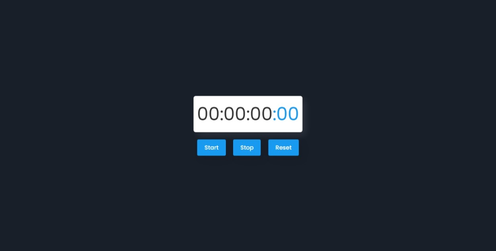

# Simple_Js_Tasks-7
## Stopwatch Application

## Table of Contents
- [Overview](#overview)
- [Features](#features)
- [Demo](#demo)
- [Technologies Used](#technologies-used)
- [Project Structure](#project-structure)
- [Contributing](#contributing)
- [Author](#author)
- [License](#license)

## Overview
A simple stopwatch web application built using HTML, CSS, and JavaScript. It allows users to start, stop, and reset the timer, displaying hours, minutes, seconds, and milliseconds.

## Features

- **Start Stopwatch**: Begins counting time when started.
- **Stop Stopwatch**: Pauses the timer when stopped.
- **Reset Stopwatch**: Resets the timer to zero.
- **Responsive Design**: Designed to work on various screen sizes (desktop, tablet, mobile).

## Demo

- Check out the [demo](https://github.com/Eng-Ahmed-Hussien) to see the Stopwatch app in action.

## Technologies Used

- **HTML**: Structure of the application.
- **CSS**: Styling the application for visual appeal and responsiveness.
- **JavaScript**: Functionality and interactivity of the stopwatch.
- **Google Fonts**: Imported for the Poppins font family.

## Project Structure

- `index.html`: HTML structure of the application.
- `./assets/Css/style.css`: CSS file for styling.
- `./assets/Js/script.js`: JavaScript file for stopwatch functionality.

## Contributing

Contributions are welcome! Fork the repository and submit a pull request.

## Author

- [Ahmed Hussien](https://github.com/Eng-Ahmed-Hussien)

## License

This project is licensed under the MIT License - see the [LICENSE](LICENSE) file for details.
